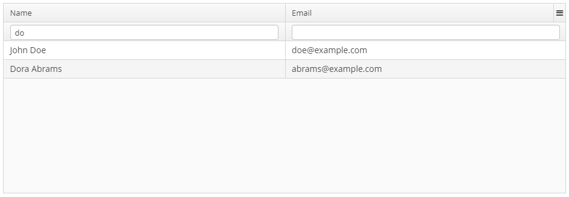

# Custom filtering for the DataGrid component

This sample application shows how to organize custom filtering for a DataGrid using build-in ability to add components to a header of footer rows.

Three approaches are covered:

1. [Query Filter](https://doc.cuba-platform.com/manual-latest/datasource_query_filter.html). See `customer-browse.xml`.
1. [Custom Datasource implementation](https://doc.cuba-platform.com/manual-latest/datasource_custom_class.html) with the help of written service to load filtered data from DB. See `not-persistent-customer-browse.xml` + `com.company.sample.web.notpersistent.CustomerDatasource`.
1. [Custom Datasource implementation](https://doc.cuba-platform.com/manual-latest/datasource_custom_class.html) with custom filtering logic without reloading data from a DB. See `filterable-browser.xml` + `com.company.sample.web.filterable.FilterableCustomerDatasource`.